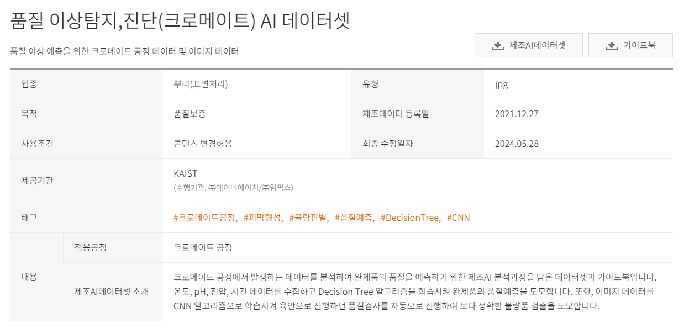
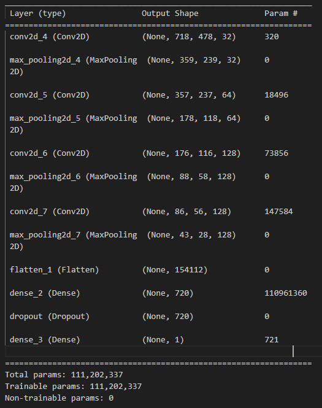
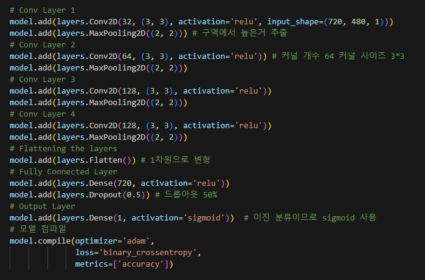
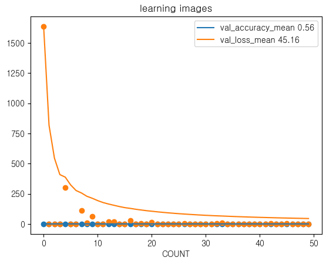
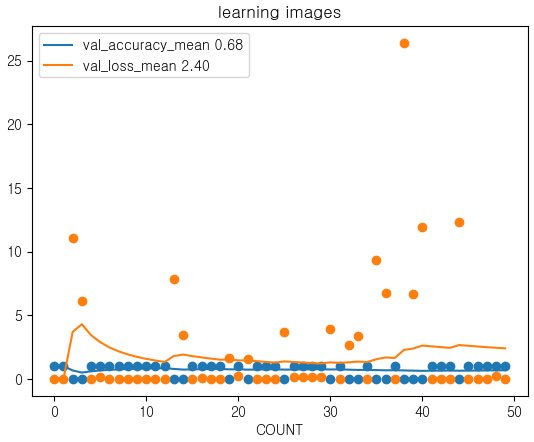
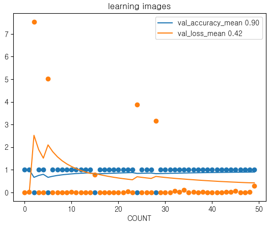
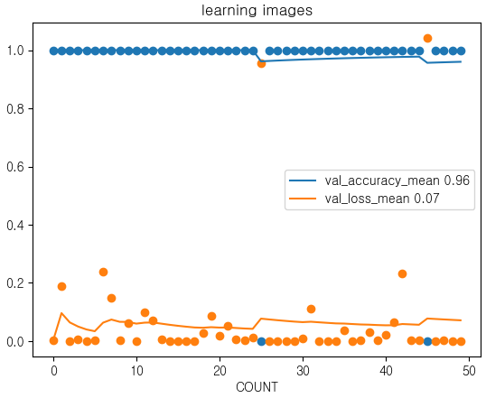
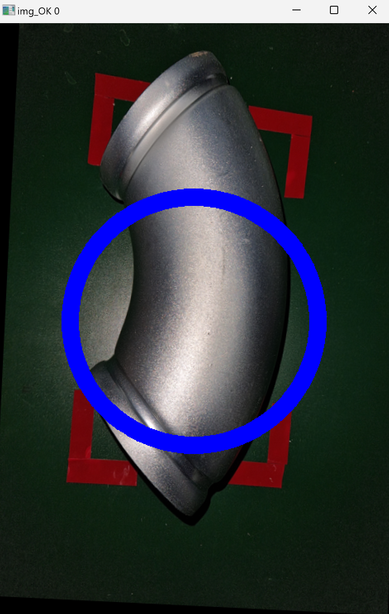
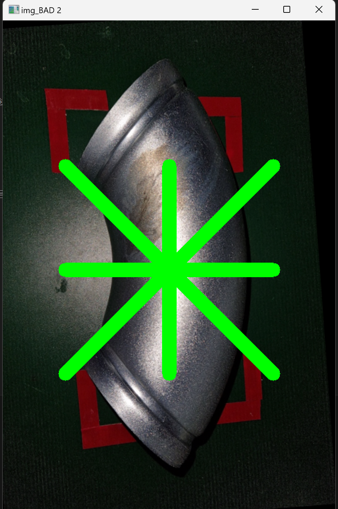

# kamp_ex
# 불량 검출 프로젝트
## Korea AI Manufacturing Platform(KAMP) Dataset. AI project using OpenCV and Tensorflow 
***
### profile
- 작성자 : 조영훈
- 연락처 : business4dyd@gmail.com
- 소속 : (주)세종교육 0317572650 경기도 성남시 수정구 수정로 167(태평동)
- 팀 : AIot 7월반
***

### 데이터 저작권 
- E-mail : kamp@kaist.ac.kr
- 중소벤처기업부, Korea AI Manufacturing Platform(KAMP), 품질 이상탐지, 진단(크로메이트) AI 데이터셋, KAIST(㈜에이비에이치, ㈜임픽스), 2021.12.27., www.kamp-ai.kr

***
### 프로젝트 일정
1. [x] github 에 프로젝트 생성 20240821
2. [x] 프로젝트 일정 수립 20240821
3. [x] 데이터 수집 20240820
4. [ ] 데이터 분석 및 전처리 20240821 ~ 20240831
5. [ ] AI 학습 및 프로그램 구현 20240901 ~ 20240910
6. [ ] 자료정리 및 발표자료 작성 20240911 ~ 20240913
7. [ ] 발표 20240919
***
### summary
- 해당 과제는 학원측에서 요구하였기에 진행 하였음
- 해당 과제를 수행하여 python기반 opencv와 tensorflow를 익히는 것에 중점을 두었다
- 학습 데이터셋은 구하기가 어려워 고르지 않고 처음 얻은 것으로 진행 하였음
- 부트 캠프 취지에 맞게 학습 데이터셋은 학원측에서 제공하였으면 하는 아쉬움이 있다
- 딥러닝 -> 평가 -> 고도화(데이터 증강 및 전처리) -> 실시간 학습 및 평가
***
### progress
1. github 생성
2. 개발환경 구축 및 git 연동
>- 개발언어 : python 3.7.9 (opencv, tensorflow, scikit-learn, pandas, numpy, seaborn
>- 개발도구 : visual studio code
>- 개발환경 : window 11 pro 64bit, i7-11700F, RAM 16G, GeForce RTX 3060

3. 데이터 분석 및 전처리
>- 성격 : 비정형 데이터(이미지), 지도학습(양품과 불량품의 사진이 구분되어 있다), 소량의 지저분한 이미지. 양품 1378장, 불량품 74장
>- 현장가정 : 직접 현장과 접촉해서 진행하는 것이 아님. 제품 표면 확인가능 방향은 위, 아래 (좌,우)이지만 정상이미지는 한쪽(왼쪽)만 있다. 아마도 데이터 증강 한듯함
> 
>*** 
>- 불량가정 : 오염 및 양생 불량 두가지가 있다고 가정하였음, 불량이미지 학습도 정상이미지와 같은 방향만 쓰도록 하겠음.
>
> 
>- 엣지검출 테스트 : 오염 부분이 드러나지 않음. 적용안함
>
> 
>- 그레이스케일 테스트 : 특징이 사라지지 않고 차원이 축소됨. 720, 480. 
>
> 
>- 전처리 : 양품 or 불량품 레이블, (특성 추출 및 군집 확인 : tensorflow), (데이터 증강 : 실시간 추가)
#### 하이퍼 파라미터
- 배치크기 : 1 
- 에포크 : 400
- 드롭아웃 : 0.5 
- 조기 종료(Early Stopping) : 드롭아웃으로 과적합을 방지하였다. 최대한 많이 학습시킴
- 활성화 함수 : sigmoid 불량품 또는 양품이므로 시그모이드를 사용하였다.
#### 모델 서머리
> 
>
#### 모델 구성
> 
> 
***

4. 딥러닝
>- 장비의 한계. 많은 이미지를 한꺼번에 학습시킬시에 커널이 죽음.
>- 이미지 한개씩 증강 시키면서 반복 학습 시킴
>
>
> 1 ~ 50회 학습
>
> 
>
> 51 ~ 100회 학습
>
> 
>
> 101 ~ 150회 학습
>
> 
>
> 400 회 학습
>
> 
>
***
5. 검증
- 간단하게 학습용으로 진행해서 그런지 정확도가 아주 잘 나온다
>
> 
>
> 
>
> 
***
6. 느낀점
- 인공지능에 엄청난 컴퓨팅 자원과 전력이 소모된다는걸 어렴풋이 느꼈음
- 잊고 지나갈 딥러닝 기술을 복습 했다는 점이 좋았음
- 부트 캠프인데 연계 기업들이 다 망한듯. 풀스택이나 해야할것 같다
- 불량 검출에 쓸 이미지는 확보는 제품 위치가 고정적이고 조명도 일정한 곳에서 하는게 맞는것 같다.
***
7. 차후 확장 계획
- 라즈베리파이에 카메라 연결
- 실시간으로 서버로 이미지 전송
- 실시간 검증 및 학습
***
8. 추가 학습 내용
- 전이학습 : 3채널(컬러)만 가능함. 연산이 무거워짐. 
- 데이터증강 : 불량 검출에는 적합 하지 않다는 생각됨. 비슷한걸 찾는게 아니라 불량 아니면 양품을 찾는게 목적 (고정된 이미지 필요)
- 
